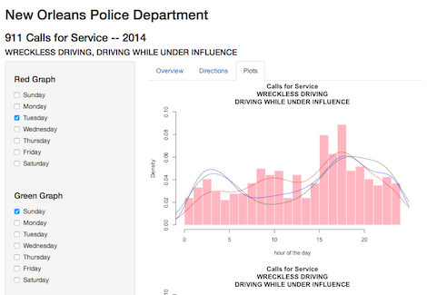

## Bad Driving and Government Transparency

http://www.nola.gov/nopd/crime-data/911-calls-for-service/

"As part of its commitment to transparency, accountability, collaboration and integrity, NOPD has the last three years of 9-1-1 records available to the public from the Orleans Parish Communication District (OPCD) external link, the administrative office of 911 for the City of New Orleans."


Yes, it list data from 2011, 2012, 2013, and 2014, known around here as the "last three years"


Wanting to keep the data small enough to fit in the free tier of shiny.io, I
chose to focus on (98,DRIVING WHILE UNDER INFLUENCE) & (99,WRECKLESS DRIVING) 
for the last year, 2014

--- .class #id 

## What I was curious about

I want to explore the relative number of calls for DRIVING WHILE UNDER INFLUENCE & WRECKLESS DRIVING  based on hour of the day and day of the week.

I chose to combine the data of the two categories, because without a traffic stop and gathering of further evidence, a person calling in such a complaint wouldn't really know the cause of the erratic driving.


## Without the Shiny App

While the data is made available for viewing on the official website, it
isn't really that useful.

First off, for 2014, there are 452640 entries in the online spreadsheet.

Even with the ablity to sort by 'Type' of call, the disply window only
shows 17 lines of the spread sheet at once, making scrolling within
half a million records a thankless task. 

--- .class #id

## Glimps of DRIVING data


```r
summary(myData[,c('TypeText','DispositionText')])
```

```
##                           TypeText                  DispositionText
##  DRIVING WHILE UNDER INFLUENCE:1197   DUPLICATE             : 152  
##  WRECKLESS DRIVING            :4219   GONE ON ARRIVAL       :3064  
##                                       Necessary Action Taken:1484  
##                                       REPORT TO FOLLOW      :  42  
##                                       UNFOUNDED             : 623  
##                                       VOID                  :  51
```

--- .class #id


